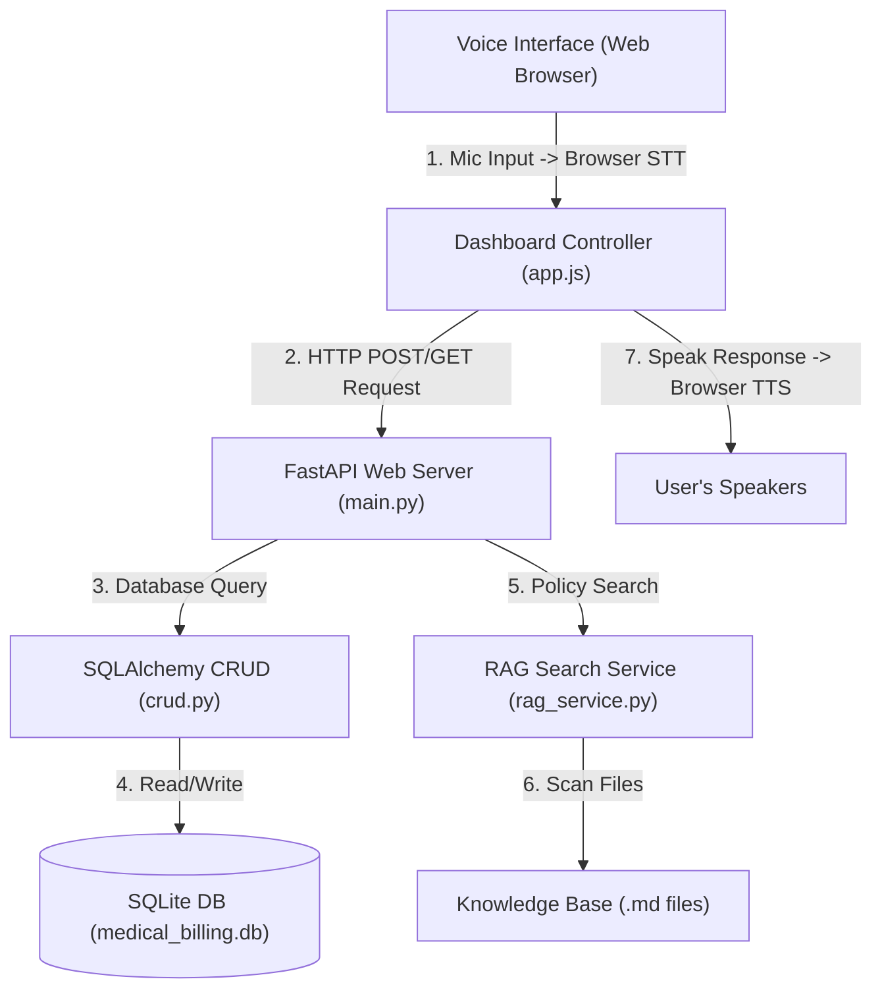

# AlphaMed Voice AI - Project & Architecture Guide

Welcome to the **AlphaMed Voice AI** learning guide. This document explains the codebase, the system architecture, how the different layers interact, and how to test the application.

---

## 🏗️ System Architecture

Our project is divided into a **Frontend Client (Browser UI)** and a **Backend Server (Python + FastAPI)**.



---

## 📁 Repository Directory Structure

Here is where all files are located and what they do:

```text
voice_ai_alphamedcare/
│
├── backend/
│   ├── app/
│   │   ├── __init__.py
│   │   ├── main.py            # FastAPI web server & static dashboard host
│   │   ├── database.py        # SQLite connection & SQLAlchemy database models
│   │   ├── crud.py            # SQL queries (Verification, Claims, Invoices, Appointments)
│   │   ├── agents/
│   │   │   ├── __init__.py
│   │   │   ├── llm_agent.py   # AI tool-binding schema & recursive completions handler
│   │   │   └── prompts.py     # System instructions (HIPAA compliance, brevity rules)
│   │   └── services/
│   │       ├── __init__.py
│   │       └── rag_service.py # Vector-ready search for FAQs & CPT reference guides
│   │
│   ├── requirements.txt       # Python environment dependencies
│   ├── test_db.py             # Unit test script to verify raw database logic
│   ├── test_rag.py            # Test script to verify local RAG search index
│   ├── test_api.py            # Integration test script to verify FastAPI endpoints
│   └── test_agent_cli.py      # Terminal chat script (Mock Demo / Real OpenAI Chat)
│
├── frontend/                  # Control Dashboard user interface
│   ├── index.html             # Structure of the dashboard console
│   ├── style.css              # Premium dark-mode glassmorphic themes
│   └── app.js                 # Browser voice engine (STT & TTS fallback)
│
├── knowledge_base/            # Markdown reference documents for policy searches
│   ├── clinic_faq.md          # Appeals, denied claims, payment plans
│   └── cpt_codes.md           # CPT medical billing codes guide
│
├── .env                       # Stored API keys (loaded dynamically)
└── .gitignore                 # Tells git to ignore databases, virtual envs, and keys
```

---

## 🔄 Step-by-Step Data Flow

Here is exactly what happens under the hood when a patient verifies their identity:

### 1. Speech-to-Text (STT)
You click the glowing microphone button on the dashboard and say:
> *"Verify John Doe, date of birth May 15th 1985, policy number POL12345."*

*   **In the browser:** The Web Speech API `webkitSpeechRecognition` captures your microphone sound waves, converts them to text for free, and hands the string to `app.js`.

### 2. Intent Parsing & API Request
*   `app.js` runs a local router that detects you are trying to verify.
*   It extracts the details: First Name (`John`), Last Name (`Doe`), DOB (`1985-05-15`), and Policy Number (`POL12345`).
*   It makes a fetch request to the FastAPI server:
    ```javascript
    fetch('http://127.0.0.1:8000/api/verify-patient', { ... })
    ```

### 3. Database Execution
*   `main.py` receives the HTTP request at `/api/verify-patient`.
*   It starts a database session and runs `crud.verify_patient()`.
*   SQLAlchemy translates the query into SQL:
    ```sql
    SELECT * FROM patients WHERE policy_number = 'POL12345' AND date_of_birth = '1985-05-15' ...
    ```
*   The query is executed against `medical_billing.db`. The database returns John Doe's ID (`1`) and insurance provider (`Blue Cross Blue Shield`).

### 4. UI Dashboard Update
*   The FastAPI server returns a success response (`200 OK`) containing John's profile.
*   `app.js` updates your screen:
    *   The red **"Unverified"** badge flashes green to **"Verified"**.
    *   John Doe's name, policy, and provider are displayed in the active profile box.
    *   The script automatically calls `/api/patients/POL12345/claims` and `/api/patients/POL12345/appointments`, loading lists of active claims and doctor appointments into the dashboard sidebar in real time.

### 5. Text-to-Speech (TTS) response
*   `app.js` formulates a vocal response: *"Thank you John Doe, I have verified your profile. How can I assist you today?"*
*   It feeds this text to the browser's built-in `speechSynthesis` API.
*   Your operating system reads the text out loud through your computer speakers.

---

## 🧪 How to Run and Test the App

### 1. Re-seed and Test Database Logic Directly (No Server needed)
Runs database tests locally to ensure SQL files are working perfectly.
```powershell
# In your project root:
.venv\Scripts\python backend\test_db.py
```

### 2. Run the Terminal Agent (Console Chat)
If you don't have an OpenAI key in your `.env`, it runs a simulated tool-calling demo. If you add your key, it launches an interactive command-line chat session with the actual LLM!
```powershell
.venv\Scripts\python backend\test_agent_cli.py
```

### 3. Test the RAG Policy Retrieval
Checks that searching terms like "CPT 72148" or "appeals" extracts the correct files.
```powershell
.venv\Scripts\python backend\test_rag.py
```

### 4. Launch the Web Server & Open the Voice Dashboard
To run the server and open the web dashboard:
```powershell
# 1. Start the server (with hot-reloading)
.venv\Scripts\uvicorn backend.app.main:app --reload

# 2. Open your browser and go to:
http://127.0.0.1:8000/
```

Click the **microphone button**, allow browser permissions, and say:
*   *“Verify John Doe, May 15th 1985, policy POL12345”*
*   *“What is my outstanding balance?”*
*   *“What is CPT code 72148?”*
*   *“Why was claim CLM10002 denied?”*
*   *“Please transfer me to a human.”*
